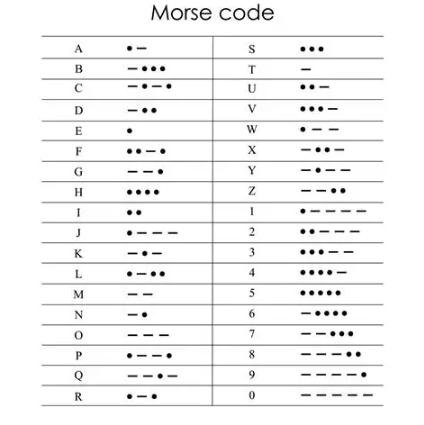

# CALLING CQ
First make sure the frequency is clear.
QRL = is freq clear?
QRZ = who's calling? 
DAV3/SD is calling CQ and BEN2/NC  is responding
```
< CQ CQ CQ DE DAV3 DAV3 PSE K
  > DAV3 de DAV3 UR 5NN 5NN NC BK

< BEN2 DE DAV3  GE ES TNX FER CALL
     UR RST 5NN 5NN 
     NAME IS DAVE DAVE 
     QTH SD  BK

< BEN2 DE DAV3 
      BK TU ES  73 DAV3 SK  ... _._
```

<center>
 morse code <br> <br>
</center>


