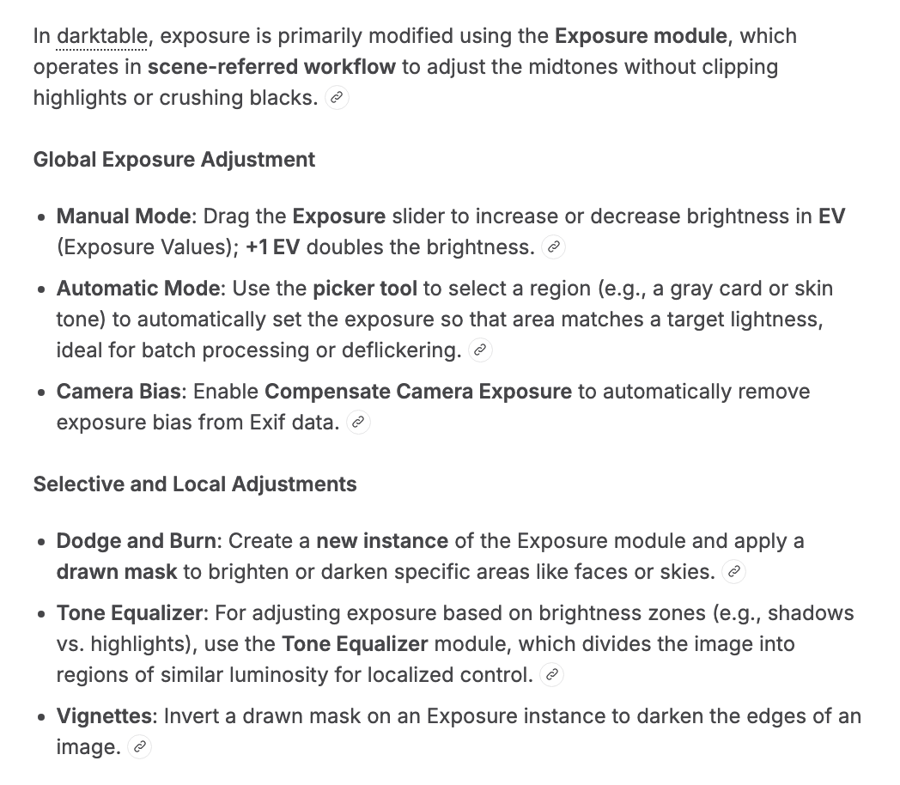

## Darktable 

# Astrophotography
 1. Tone Curve -> then mask - oval or round
 2. Color balance RGB -> Global Saturation - increase
 3. Color balance RGB -> Global Brilliance - increase
 4. Color balance RGB -> Hue Shift ->  Red- Yellow - Green  
     - Used for bringing out the colors
 5. (|) Correct -> astrophoto denoise ->  
 6. (|) Correct -> denoise 
 7. (|) Correct -> sharpen ? maybe,zoom in and find out

# Indoor Edits
## Light Color and Tones

  
  
  
  
  

## Editing 
  
  

## Exposure 
  

## Exporting
  
  
  

