## Darktable 
 - Lighttable Menu stores all imported photos
 - Darkroom is where you make your changes

### Lower Menu Items A - G

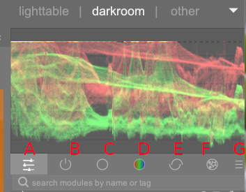

### 02 [A] Quick Access Panel

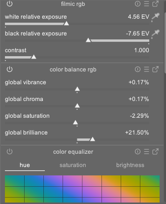

### 03 [B] Show only Active Modules

### 04 [C] Base

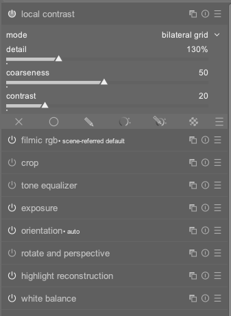

### 05 [D] Color

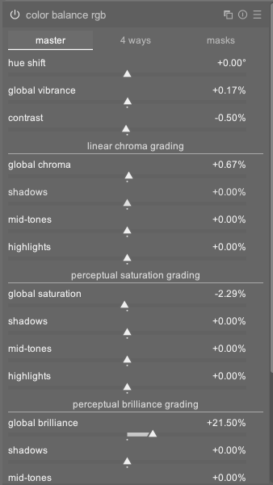

### 06 [E] Correct

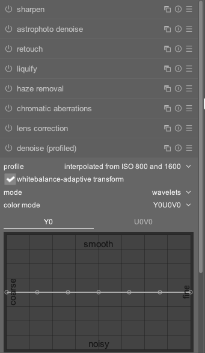

### 07 [F] Effect

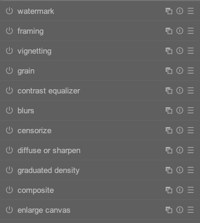

### 08 [G] Presets

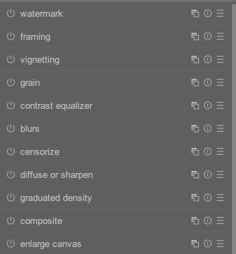

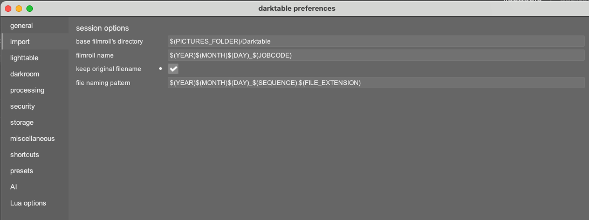

# Astrophotography
 1. Tone Curve -> then mask - oval or round
 2. Color balance RGB -> Global Saturation - increase
 3. Color balance RGB -> Global Brilliance - increase
 4. Color balance RGB -> Hue Shift ->  Red- Yellow - Green  
     - Used for bringing out the colors
 5. (|) Correct -> astrophoto denoise ->  
 6. (|) Correct -> denoise 
 7. (|) Correct -> sharpen ? maybe,zoom in and find out

# Indoor Edits
## Light Color and Tones

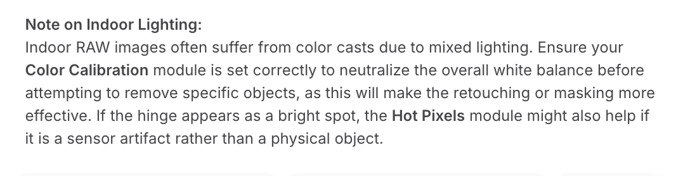  
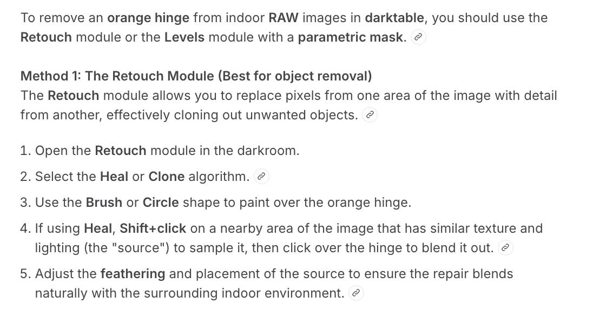  
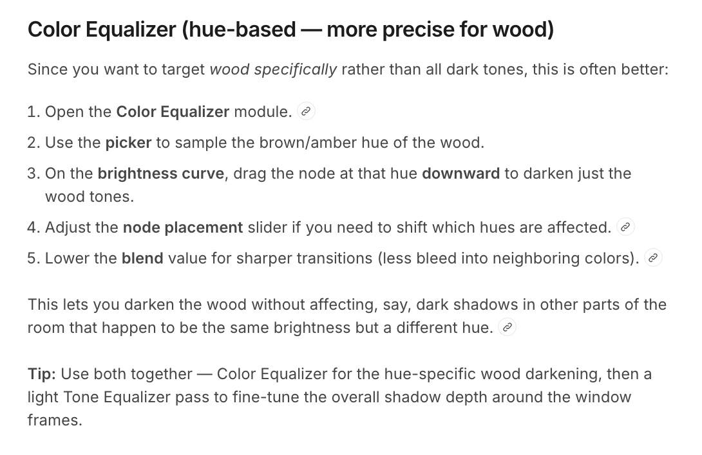  
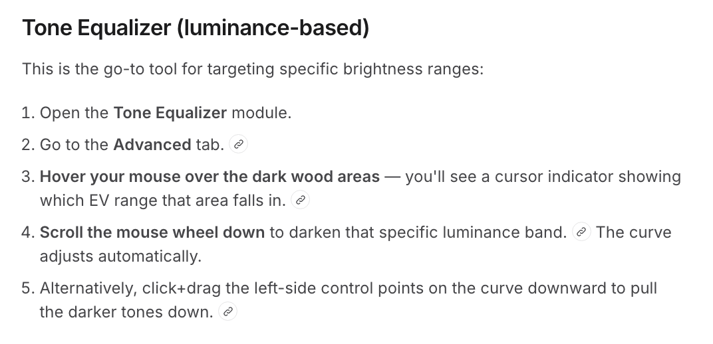  
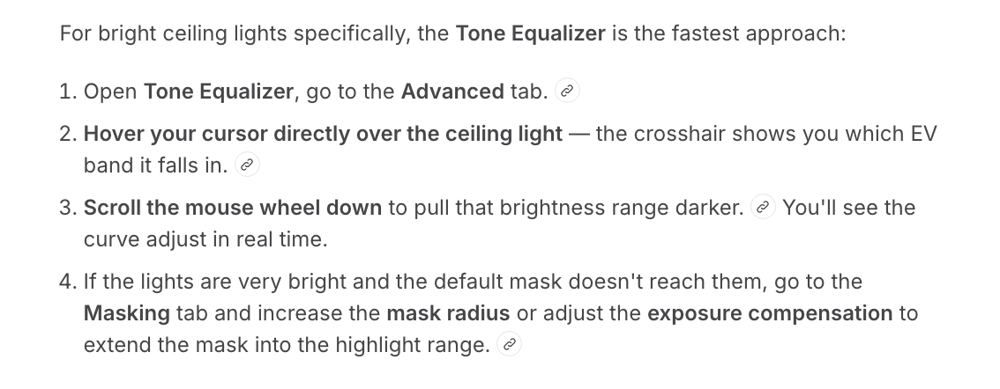  

## Editing 
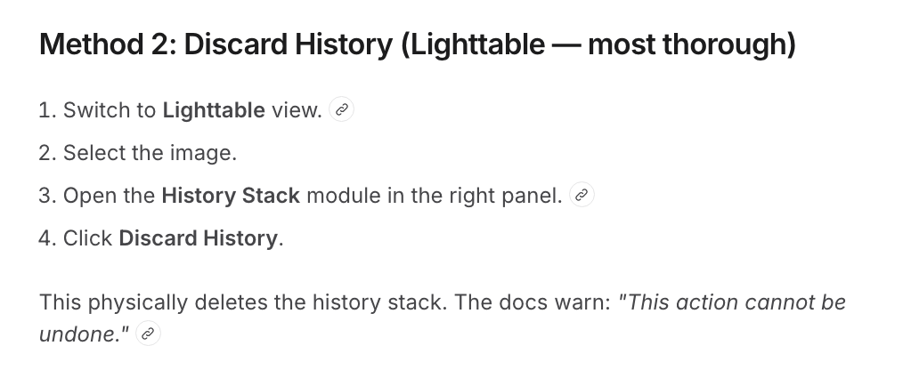  
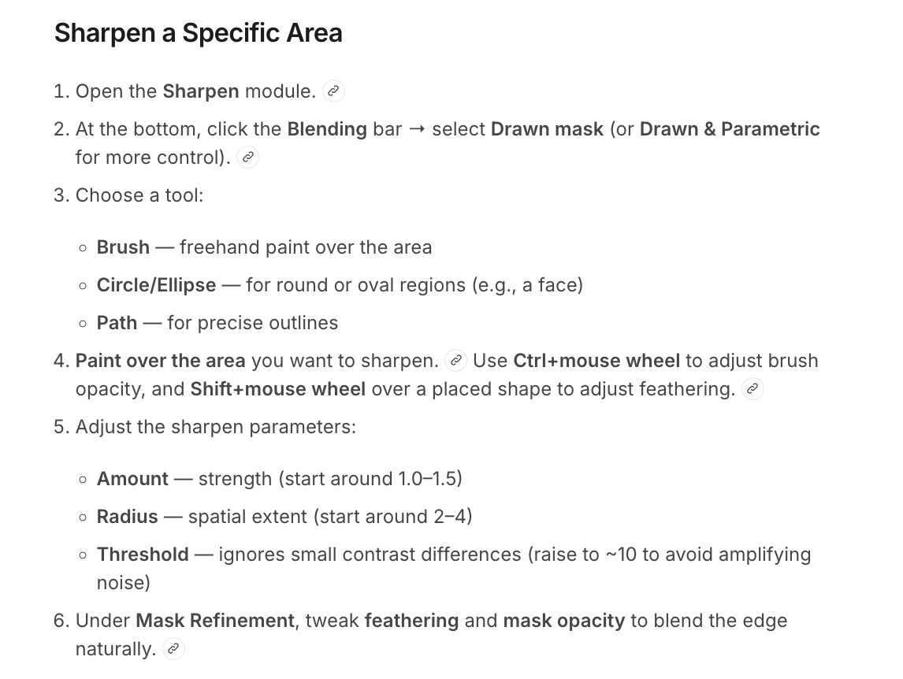  

## Exporting
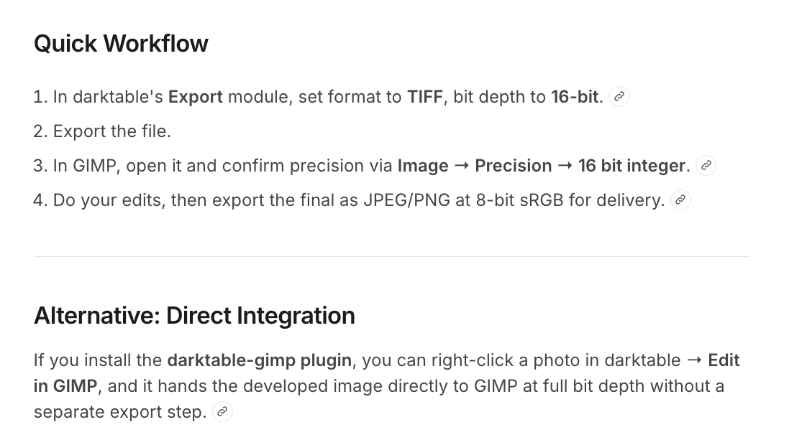  
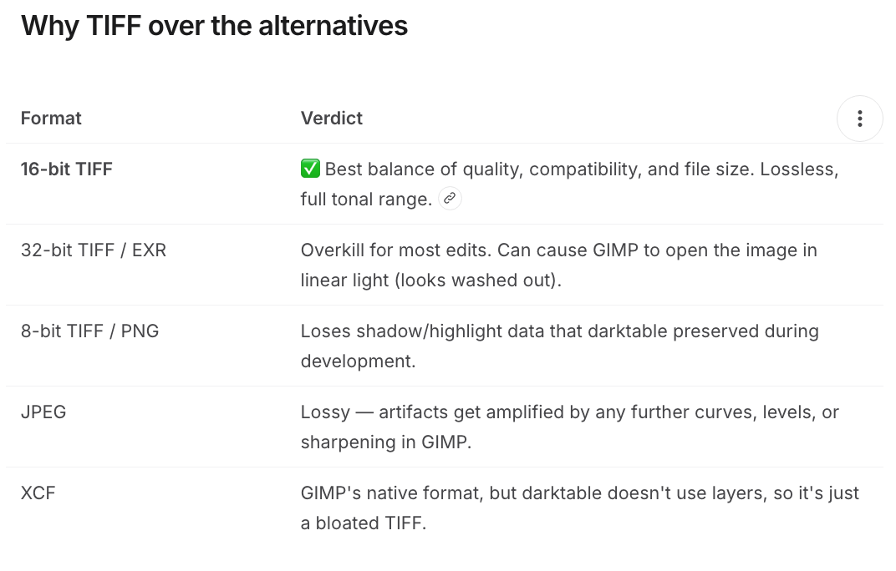  
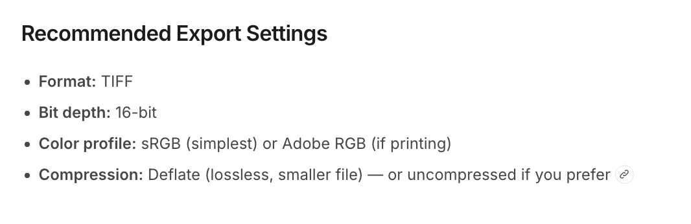  

