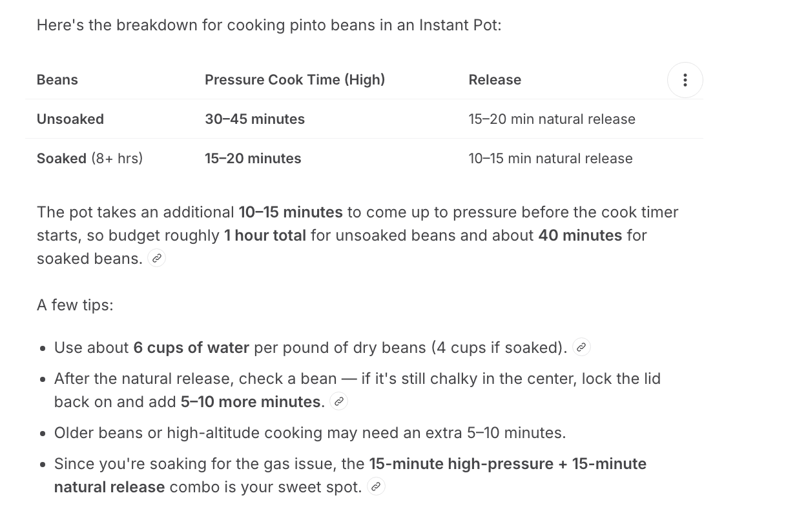
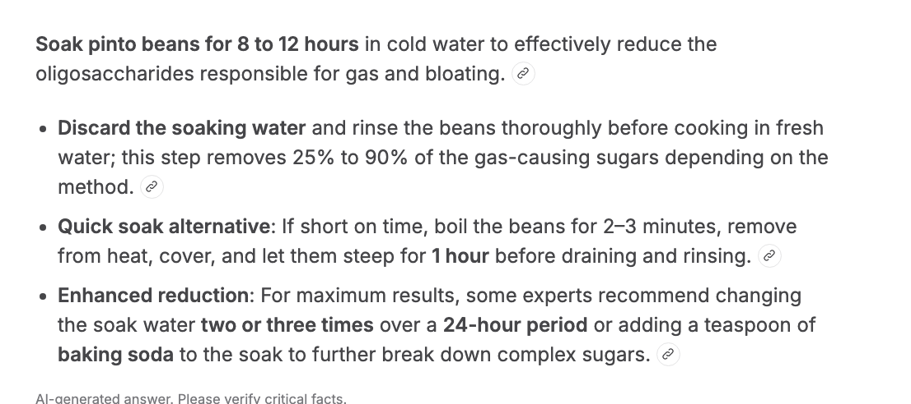

## Bread recipes
 - [ Sourdough Starter  ](https://www.youtube.com/watch?v=-9Osn7JsP1Y)
 - [ Bread recipe 4 ingredient easy   ](https://www.youtube.com/watch?v=ukMbpMuof3g)
 - [ Toaster Oven Sourdough Bread  ](https://www.youtube.com/watch?v=80yPPa00Bi4)
 - [ Sourdough Bread   ](https://www.youtube.com/watch?v=r5h1pOgu8jw)
 - [ Easy Bread recipe   ](https://www.youtube.com/watch?v=noD6LMjktDQ)
 - [ Easy Bread recipe 2 ](https://www.youtube.com/watch?v=I0t8ZAhb8lQ) 
 - [ Caroway Rye Bread Recipe ](https://www.youtube.com/watch?v=eljLwIAleKc)
 - [ Random Sourdough recipes  ](https://www.kingarthurbaking.com/recipes/collections/sourdough-discard-recipes)
 - [ Artisan Bread  ](https://marysnest.com/easy-artisan-bread/)

## Specialty recipes 
 - [ Mayonaise from Scratch   ](https://www.feastingathome.com/mayonnaise-recipe/)
 - [ chickpeas, cocoa, dates pistachio recipe ](https://www.youtube.com/shorts/I7FhM_wpZJg)
 - [ Burger sauce ](https://www.youtube.com/shorts/cLuOnLb1lOc)
 - [ Candied Grapes   ](https://www.youtube.com/watch?v=1Ylo-J4qKok)
 - [ Ginger and Red Date tea ](https://www.youtube.com/watch?v=PT5mVfIgTe4)
 - [ Date Seed Coffee ](https://www.youtube.com/watch?v=N5yCuLfZez4)

## Meats
 - [ Real Barbacoa - Cachete and Tongue ](https://www.youtube.com/watch?v=TVbBZF33ApU)
 - [Slow cooked Beef Barbacoa](https://www.youtube.com/watch?v=c0g1M9MQZnk)
 - [ Barbacoa w/ chuck roast ](https://www.youtube.com/shorts/1GNM2FCi02E)
 - [ fried chicken recipe ](https://www.youtube.com/shorts/XIrI8yL453k)

### Enchilada Sauce
 - Homemade sauces often prioritize dried chiles like guajillo or ancho
 - Cumin is the backbone of flavor — even just a pinch really rounds out the whole thing. 
 - A tiny pinch of smoked paprika 
 - paprika, dried herbs , oregano - pinch of sugar
 - Mix 1 tablespoon cornstarch + 1 tablespoon cold water per cup of sauce in a small bowl until smooth and lump-free.  

### Instapot Yogurt
1. Heat the Milk
Pour milk into the Instant Pot inner pot, seal the lid, and set the valve to Sealing.  Press the Yogurt button and then Adjust until the display reads "Boil." This process heats the milk to approximately 180–200°F (82–93°C) to denature proteins, which helps thicken the yogurt. 

2. Cool and Culture
Remove the pot and let the milk cool to 110–115°F (43–46°C).  You can speed this up by placing the inner pot in an ice water bath. Once cooled, stir in 2 tablespoons of plain yogurt starter (with live active cultures) per quart of milk.  Whisk thoroughly to ensure the culture is evenly distributed.

3. Incubate
Return the inner pot to the Instant Pot base and lock the lid (the valve position does not matter during incubation). Press Yogurt and set the timer for 8–12 hours (8 hours for milder yogurt, up to 12 for a tarter flavor).  After incubation, refrigerate the yogurt for at least 4 hours to set before serving. 

Simplified Method for UHT/Ultra-Pasteurized Milk
If using ultra-pasteurized milk, you can skip the boiling and cooling steps entirely.  Simply whisk the starter culture directly into the cold milk in the Instant Pot, press Yogurt, and incubate for 8–10 hours. 

Leaving yogurt to incubate for 12+ hours in an Instant Pot is generally safe and results in a tangier, more acidic product with lower lactose content.

 - Safety: The high acidity developed during fermentation acts as a natural preservative, preventing the growth of harmful pathogens; users report no ill effects from leaving yogurt in the pot for 12–24 hours. 
 - Texture and Taste: The yogurt will be thicker and sourer than the standard 8-hour batch, as the bacterial cultures continue to consume lactose and thicken the milk proteins. 
 - Probiotics: Longer incubation can increase the number of probiotics up to a point, though some users note that bacteria may begin to die off after 24 hours once lactose is depleted. 
 - Usage: If the yogurt is too sour for eating plain, it can be used for baking, smoothies, or made into buttermilk by adding water and salt.

###  Cooking Beans 
  
   

 - [Bean cooking AI](https://www.youtube.com/watch?v=T7xg9gDumX8)
 - [Instapot Pinto Beans ](https://www.youtube.com/watch?v=L8oKDUpup6E)

### Bean recipes
 - Frijoles de la Olla 
 - [Refried Bean Recipes ](https://www.youtube.com/watch?v=UPziyyZ1m9s)
 - [Charro beans](https://www.youtube.com/watch?v=H2adP10zvoE)
 
### Lactate Enzyme on raw milk
Can lactose supplement caplet lactase enzyme be used to convert raw milk into lactose free milk

**Yes**, lactase enzyme supplement caplets (such as Lactaid) can be used to convert raw milk into lactose-free milk at home by adding the enzyme directly to the milk.

To achieve this, follow these steps:
*   **Preparation**: Crush the caplets into a fine powder and dissolve them in a small amount of warm water.
*   **Dosage**: Add the solution to the milk; typical recommendations suggest roughly **7 drops of liquid equivalent** or one crushed caplet per pint/liter, though bulk powder may require adjustment.
*   **Incubation**: Refrigerate the milk for **24 to 48 hours** to allow the lactase enzyme to break down the lactose into glucose and galactose.
*   **Safety Note**: While the enzymatic process makes the lactose digestible, **raw milk itself carries significant bacterial risks**. Lactase treatment **does not** pasteurize the milk or kill pathogens like Salmonella or E. coli; therefore, using raw milk for this purpose remains unsafe regardless of lactose content.

 
